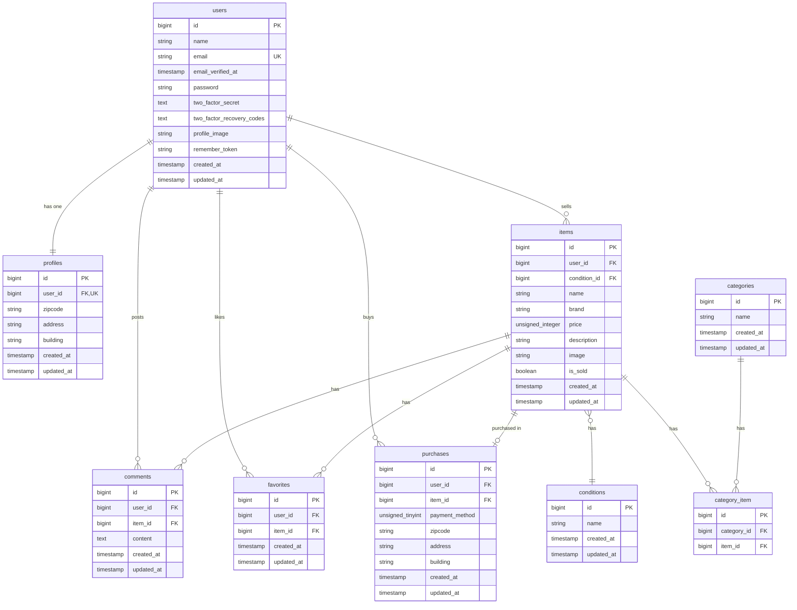

# coachtechフリマ

ユーザー間で商品の出品・購入・コメント・いいねができるフリマアプリケーションです。

## 機能一覧

- **会員登録・ログイン** (Laravel Fortify / メール認証対応)
- **商品一覧表示** (おすすめ・マイリスト切替、検索機能)
- **商品詳細表示** (カテゴリ・状態・コメント・いいね数表示)
- **商品出品** (画像アップロード、カテゴリ・状態選択)
- **商品購入** (Stripe決済、配送先住所変更)
- **コメント機能** (商品への投稿・削除)
- **いいね機能** (お気に入りトグル)
- **プロフィール管理** (プロフィール画像・住所・名前の編集)
- **マイページ** (出品した商品・購入した商品一覧)

## 技術スタック

| 項目 | 技術 |
|---|---|
| 言語 | PHP 8.x |
| フレームワーク | Laravel 8.x |
| 認証 | Laravel Fortify |
| データベース | MySQL 8.0 |
| インフラ | Docker / Docker Compose |
| Webサーバー | Nginx |
| 決済 | Stripe API |
| メール (開発) | MailHog |
| 画像保存 | Laravel Storage (public) |
| テスト | PHPUnit |

## アーキテクチャ

```
Controller → Model
```

- **Controller**: リクエスト受付・ビジネスロジック・レスポンス返却
- **Model**: Eloquentリレーション・データアクセス
- **FormRequest**: バリデーションロジック (コントローラーから分離)

## ディレクトリ構成 (主要部分)

```
src/
├── app/
│   ├── Http/
│   │   ├── Controllers/     # コントローラー
│   │   └── Requests/        # FormRequestバリデーション
│   ├── Models/              # Eloquentモデル
│   └── Providers/           # サービスプロバイダ
├── database/
│   ├── factories/           # テストデータ用ファクトリ
│   ├── migrations/          # マイグレーション
│   └── seeders/             # シーダー
├── resources/
│   └── views/               # Bladeテンプレート
├── routes/
│   └── web.php              # ルーティング
└── storage/
    └── app/public/items/    # 商品画像保存先
```

## データベース設計 (主要テーブル)

| テーブル名 | 説明 |
|---|---|
| `users` | ユーザー情報 |
| `items` | 出品商品 |
| `categories` | カテゴリマスタ |
| `category_item` | カテゴリ×商品 中間テーブル |
| `conditions` | 商品状態マスタ |
| `comments` | コメント |
| `favorites` | いいね (お気に入り) |
| `profiles` | ユーザープロフィール (住所情報) |
| `purchases` | 購入履歴 (配送先スナップショット含む) |

## ER図



### テーブル役割の解説

| テーブル | 役割 |
|---|---|
| **users** | アプリケーションの全ユーザーを管理。認証情報（メール・パスワード・二段階認証）とプロフィール画像を保持します。 |
| **profiles** | ユーザーの住所情報（郵便番号・住所・建物名）を管理。`user_id` にユニーク制約があり、ユーザーと **1:1** の関係です。購入時のデフォルト配送先として使用されます。 |
| **items** | 出品された商品の情報を管理。出品者（`user_id`）、商品状態（`condition_id`）、名前、ブランド、価格、説明、画像パス、売却済みフラグを保持します。 |
| **conditions** | 商品の状態（良好・目立った傷や汚れなし・やや傷や汚れあり・状態が悪い 等）を定義するマスタテーブルです。 |
| **categories** | 商品カテゴリ（ファッション・家電・本 等）を定義するマスタテーブルです。 |
| **category_item** | `items` と `categories` の **多対多（n:m）** 関係を実現する中間テーブル。1つの商品に複数のカテゴリを紐付けられます。 |
| **comments** | ユーザーが商品に対して投稿するコメントを管理。`user_id` と `item_id` で誰がどの商品にコメントしたかを記録します。 |
| **favorites** | いいね（お気に入り）機能を管理。`user_id` と `item_id` のペアにユニーク制約があり、同じユーザーが同じ商品に二重にいいねできない仕組みです。 |
| **purchases** | 購入履歴を管理。**配送先住所のスナップショット**（`zipcode`, `address`, `building`）を購入時点の値として保持します。これにより、ユーザーがプロフィールの住所を後から変更しても、購入時に指定した配送先がそのまま残り、正確な配送情報を維持できます。`payment_method` で決済方法（コンビニ払い・カード払い等）も記録します。 |

## 環境構築

### 前提条件

- Docker / Docker Compose がインストール済みであること

### セットアップ手順

```bash
# 1. リポジトリをクローン
git clone <repository-url>
cd flea-market-app

# 2. Dockerコンテナをビルド・起動
docker compose up -d --build

# 3. Composerパッケージのインストール
docker compose exec php composer install

# 4. 環境設定ファイルの準備
docker compose exec php cp .env.example .env

# 5. アプリケーションキーの生成
docker compose exec php php artisan key:generate

# 6. マイグレーションの実行
docker compose exec php php artisan migrate

# 7. シーダーの実行
docker compose exec php php artisan db:seed

# 8. ストレージのシンボリックリンク作成
docker compose exec php php artisan storage:link
```

### Stripe（カード/コンビニ決済）設定

本アプリの購入機能は Stripe Checkout を利用しています。`.env` に以下を設定してください。

```dotenv
STRIPE_KEY=pk_test_xxxxxxxxxxxxxxxxx
STRIPE_SECRET=sk_test_xxxxxxxxxxxxxxxxx
```

- テスト用キーは Stripe ダッシュボードの **開発者 > API キー** から取得できます。
- `STRIPE_SECRET` が未設定の場合、購入時に「決済サービスの設定が完了していません。」エラーになります。
- 本リポジトリの購入フローは Checkout のリダイレクト方式のため、ローカル検証時は基本的に Webhook 設定は必須ではありません。

### テスト用DBの準備

`php artisan test` は開発DBとは別のテスト用DBを利用してください。  
（開発データの保護と、毎回クリーンな状態での実行のため）

```bash
# MySQLコンテナ内でテスト用DBを作成（初回のみ）
docker compose exec mysql mysql -uroot -proot -e "CREATE DATABASE IF NOT EXISTS laravel_db_test;"
```

`src/.env.testing`（またはテスト実行時の環境変数）に接続先を設定します。

```dotenv
APP_ENV=testing
DB_CONNECTION=mysql
DB_HOST=mysql
DB_PORT=3306
DB_DATABASE=laravel_db_test
DB_USERNAME=root
DB_PASSWORD=root
```

### 各サービスのアクセスURL

| サービス | URL |
|---|---|
| アプリケーション | http://localhost |
| phpMyAdmin | http://localhost:8080 |
| MailHog | http://localhost:8025 |

> セットアップ完了後の動作確認方法は「[動作確認の手順](#動作確認の手順)」セクションを参照してください。

## 動作確認の手順

初めてこのアプリケーションを操作する方向けに、会員登録からメール認証・各機能の利用までの流れを説明します。

### 1. 会員登録

1. ブラウザで http://localhost にアクセスします
2. ヘッダーの **「会員登録」** をクリックします
3. ユーザー名・メールアドレス・パスワードを入力し、**「登録する」** ボタンを押します
4. 登録が完了すると、**メール認証誘導画面**（`/email/verify`）に自動でリダイレクトされます

### 2. メール認証（MailHog）

本アプリの開発環境では、メール送信に **MailHog** を使用しています。  
MailHogはすべてのメールをキャプチャするローカルツールのため、**実際のメールアドレス（Gmail・iCloudなど）には届きません。** 以下の手順で認証を完了してください。

1. ブラウザの **別タブ** で http://localhost:8025 を開きます（MailHog の WebUI）
2. 受信一覧に **「Verify Email Address」** という件名のメールが届いています
3. メールを開き、本文中の **「Verify Email Address」** ボタンをクリックします
4. メール認証が完了し、**プロフィール設定画面** にリダイレクトされます

> **⚠️ 注意点**
> - 認証リンクの有効期限は **60分** です。期限切れの場合は、`/email/verify` 画面の **「認証メールを再送する」** ボタンを押して、MailHogで新しいメールを確認してください。
> - 認証リンクは **ログイン中のブラウザと同じブラウザ** で開く必要があります（認証済みセッションが必要なため）。

### 3. プロフィール設定

メール認証完了後、プロフィール設定画面が表示されます。

1. プロフィール画像・ユーザー名・郵便番号・住所・建物名を入力します
2. **「更新する」** ボタンを押してプロフィールを保存します

> プロフィールで登録した住所は、商品購入時のデフォルト配送先として使用されます。

### 4. 主な機能の動作確認

メール認証が完了すると、以下の機能が利用可能になります。

| 機能 | 操作方法 |
|---|---|
| **商品一覧** | トップページ（`/`）で「おすすめ」「マイリスト」タブを切り替え。ヘッダーの検索バーでキーワード検索も可能 |
| **商品詳細** | 商品一覧から商品をクリック |
| **いいね** | 商品詳細画面のハートアイコンをクリック |
| **コメント** | 商品詳細画面でコメントを入力し送信 |
| **商品出品** | ヘッダーの **「出品」** ボタンから商品画像・情報を入力して出品 |
| **商品購入** | 商品詳細画面の **「購入手続きへ」** → 支払い方法を選択 → **「購入する」** |
| **マイページ** | ヘッダーのユーザー名をクリックして、出品した商品・購入した商品を確認 |

### 5. ログイン / ログアウト

| 操作 | 方法 |
|---|---|
| ログイン | ヘッダーの **「ログイン」** → メールアドレス・パスワードを入力 |
| ログアウト | ヘッダーの **「ログアウト」** をクリック |

> **メール未認証の状態でログインした場合**、メール認証誘導画面（`/email/verify`）にリダイレクトされます。認証を完了するまで、マイページ・出品・購入などの機能は利用できません。


## テストの実行方法

主要機能の正常動作を保証する自動テスト（Feature Test）を実装しています。

### 実行コマンド

```bash
docker compose exec php php artisan test
```

必要に応じて、特定ファイルのみ実行することもできます。

```bash
docker compose exec php php artisan test tests/Feature/CoreFeatureRequirementsTest.php
```

### テスト概要

| テストファイル | テスト内容 |
|---|---|
| `ItemListTest.php` | 商品一覧の絞り込み（おすすめ・マイリスト）、キーワード検索、検索状態の維持 |
| `PurchaseTest.php` | 購入時の住所スナップショット保存、決済後の商品ステータス（`is_sold`）更新 |

- テスト用データベース（`laravel_db_test`）を使用するため、開発用データに影響はありません。
- テスト実行ごとにデータベースがリセットされます（`RefreshDatabase`）。

## 命名規則

| 対象 | ルール | 例 |
|---|---|---|
| モデル / コントローラー | アッパーキャメルケース | `ItemController`, `UserProfile` |
| マイグレーション / カラム名 | スネークケース | `user_id`, `item_name` |
| バリデーション | FormRequestクラスで分離 | `StoreItemRequest` |
